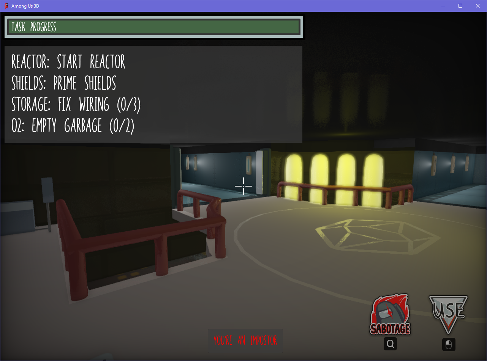
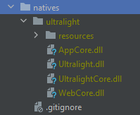

# Among Us 3D
A fan-made free and open-source 3D remake of Among Us by Innersloth.

## Disclaimer
**Important**: This is **NOT** an official version of Among Us, nor is it associated with Among Us or Innersloth in any way.
It does **not** intend any copyright infringement whatsoever. I'm just a fan of Among Us and wanted to make a 3D version of it :P

- Textures and sounds are from the original game and are **Copyright Innersloth LLC**
- The map model was made by [Sketchup Aprendizaje Latinoamerica](https://sketchfab.com/3d-models/among-us-map-the-skeld-59a93886f9e74ff6836dff0c269da45f) and slightly modified by me

## Screenshot


## Features
- Almost all tasks and sabotages from the original game
- Emergency meetings (almost) like in the original game
- Fully 3D game map (currently only The Skeld)
- And various other things from the original game such as cameras, player colors, vents, etc.

## Currently not implemented
- Admin Table and the Minimap
- Door sabotages

## Building from source
To build from source, first download [Ultralight](https://ultralig.ht) and extract it to the `natives` folder. The directory structure
then should look similar to this:


Now it's just a regular Gradle project that you can build using IntelliJ etc. or with
```
$ gradlew jar
```

Make sure that the `assets` folder is in the working directory of the app when running, or else it will crash.

## Configuring
You can connect to custom servers by setting the `AMOGUS_IP` environment variable to the server you want to connect to.